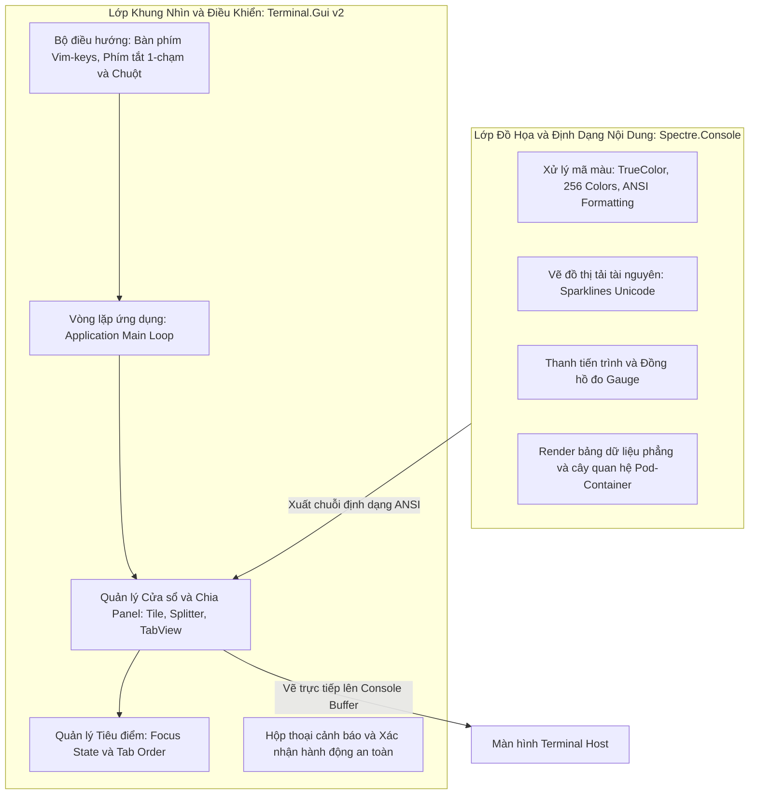
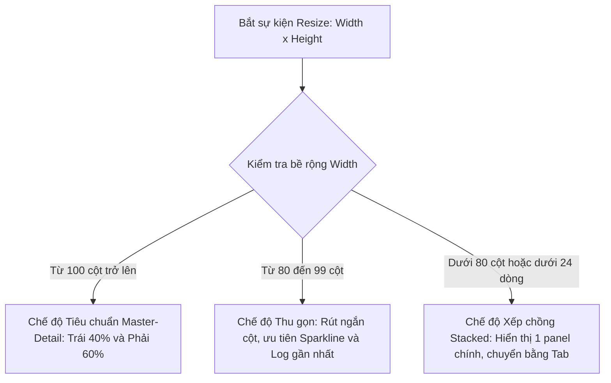
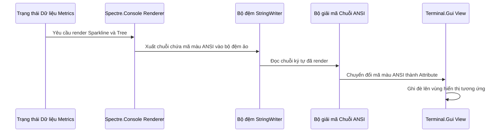

# ĐIỀU TRA KỸ THUẬT 02: KIẾN TRÚC GIAO DIỆN & TÍCH HỢP TERMINAL.GUI + SPECTRE.CONSOLE
## DỰ ÁN: PODMAN-FUI

- **Mã tài liệu:** INV-02-UI-RENDERING
- **Trạng thái:** Hoàn thành điều tra
- **Mục tiêu:** Phân tích kiến trúc giao diện TUI, cơ chế co giãn linh hoạt (Responsive/Auto-scaling Layout), và giải pháp kết hợp giữa Terminal.Gui v2 (Window Manager) và Spectre.Console (Graphics & ANSI Renderer).

---

## 1. PHÂN CÔNG TRÁCH NHIỆM: TERMINAL.GUI VS SPECTRE.CONSOLE

Để tạo nên một ứng dụng TUI chuyên nghiệp, mượt mà và trực quan, hệ thống phân chia trách nhiệm giao diện thành hai lớp rõ ràng:

### 1.1. Vai trò của Terminal.Gui v2
- **Quản lý Vòng đời & Render Buffer:** Đảm nhiệm việc khởi tạo chế độ Raw Mode trên console, bắt sự kiện kích thước terminal thay đổi (`SIGWINCH`), và tối ưu hóa việc vẽ lại màn hình (Diff render buffer) để chống hiện tượng giật/nhấp nháy (flickering).
- **Hệ thống Định vị Linh hoạt (Computed Layout):** Cung cấp hệ thống tính toán tọa độ tự động thông qua `Pos` và kích thước tương đối thông qua `Dim`.
- **Xử lý Tương tác (User Interaction):** Quản lý toàn diện sự kiện bấm phím, điều hướng tiêu điểm qua lại giữa các panel, và bắt sự kiện chuột (chuột trái chọn thực thể, con lăn chuột cuộn nội dung).

### 1.2. Vai trò của Spectre.Console
- **Bộ máy Tô màu & Định dạng ANSI (Rich Text Markup):** Cung cấp cú pháp đánh dấu trực quan để đổi màu sắc văn bản theo trạng thái (Xanh lá: Healthy, Vàng: Warning, Đỏ: Critical, Xám: Stopped).
- **Biểu diễn Đồ họa Ký tự (Text-based Graphics):**
  - **Sparklines:** Render biểu đồ đường sử dụng các ký tự khối Unicode (` `, `▂`, `▃`, `▄`, `▅`, `▆`, `▇`, `█`) để biểu thị xu hướng biến thiên của CPU và RAM theo thời gian.
  - **BarCharts & Gauges:** Render thanh đo tỷ lệ phần trăm trực quan.
  - **Tree Views:** Render phân cấp cha - con giữa Pod và các Container bên trong.

---

## 2. KIẾN TRÚC CO GIÃN ĐỘ PHÂN GIẢI ĐỘNG (RESPONSIVE AUTO-SCALING)

Một trong những yêu cầu nghiêm ngặt của `podman-FUI` là **không cố định độ phân giải**, mà phải co giãn mượt mà theo bất kỳ kích thước terminal nào của người dùng.

### 2.1. Cơ chế Bắt Tín hiệu Thay đổi Kích thước (Resize Handling)
- Khi cửa sổ terminal bị thay đổi kích thước (kéo giãn bằng chuột, phóng to full màn hình, hoặc chia ô trong tmux), nhân Linux gửi tín hiệu `SIGWINCH` tới tiến trình.
- Vòng lặp `Terminal.Gui` bắt tín hiệu này, truy vấn lại kích thước mới `(Width, Height)` từ trình điều khiển màn hình, và kích hoạt pha `LayoutSubviews()` trên toàn bộ cây giao diện.

### 2.2. Chiến lược Phân vùng & Breakpoint Kích thước

### 2.3. Quy tắc Tính toán Kích thước Tương đối (Relative Dimensions)
- **Top Bar (Thanh điều hướng phân loại):**
  - Vị trí: `Y = 0`, `X = 0`.
  - Kích thước: `Height = 1`, `Width = 100% (Fill)`.
- **Panel Trái (Danh sách Thực thể):**
  - Vị trí: `Y = 1`, `X = 0`.
  - Kích thước: `Width = 40% (Percent)`, `Height = Chiều cao còn lại trừ thanh Footer (Fill - 1)`.
- **Panel Phải (Chi tiết, Giám sát, Log, Inspect):**
  - Vị trí: `Y = 1`, `X = Điểm kết thúc của Panel Trái (Right)`.
  - Kích thước: `Width = 60% (Fill)`, `Height = Chiều cao còn lại trừ thanh Footer (Fill - 1)`.
- **Footer Bar (Thanh trạng thái & Phím tắt):**
  - Vị trí: `Y = Dòng cuối cùng (Bottom - 1)`, `X = 0`.
  - Kích thước: `Height = 1`, `Width = 100% (Fill)`.

---

## 3. CƠ CHẾ TÍCH HỢP RENDERING GIỮA HAI THƯ VIỆN

Vấn đề kỹ thuật lớn nhất khi kết hợp `Terminal.Gui` và `Spectre.Console` là:
- `Terminal.Gui` sở hữu bộ đệm màn hình riêng (Screen Buffer) với hệ tọa độ ô ký tự `(Rune, Attribute)`.
- `Spectre.Console` mặc định xuất thẳng chuỗi thoát ANSI (ANSI Escape Sequences) ra luồng đầu ra tiêu chuẩn `stdout`. Nếu xuất thẳng sẽ làm vỡ bộ đệm của `Terminal.Gui`.

### 3.1. Kỹ thuật Render Gián tiếp qua Bộ đệm Ảo (Virtual Console Output)
Để giải quyết triệt để vấn đề này, quy trình kết xuất được thiết kế như sau:

### 3.2. Chống Nhấp Nháy (Anti-Flickering & Throttling)
- Việc cập nhật dữ liệu tài nguyên diễn ra với tần suất 1.5 - 2 giây/lần, trong khi log stream có thể đẩy hàng chục dòng mỗi giây.
- **Cơ chế Điều tiết (Throttling):**
  - Luồng nhận dữ liệu Socket gom các cập nhật vào hàng đợi tạm (Queue).
  - Vòng lặp giao diện chỉ kích hoạt vẽ lại (Redraw) tối đa 30 - 60 lần/giây (hạn chế tối đa việc tiêu thụ CPU không cần thiết).
  - Nếu nội dung của một khung nhìn (ví dụ bảng Inspect tĩnh) không có sự thay đổi dữ liệu, hệ thống bỏ qua bước render lại khung nhìn đó.

---

## 4. HỆ THỐNG ĐIỀU HƯỚNG TƯƠNG TÁC: BÀN PHÍM VÀ CHUỘT

### 4.1. Bản đồ Phím tắt Toàn cục (Global Keymap Engine)
Hệ thống bắt phím được xử lý theo 3 mức ưu tiên:
1. **Mức 1 - Phím Khẩn cấp / Thoát (System Level):**
   - `Ctrl+C` hoặc `q`: Kích hoạt quy trình thoát an toàn, khôi phục trạng thái terminal bình thường.
2. **Mức 2 - Phím Điều hướng Nhanh (Navigation Level):**
   - Phím số `1`, `2`, `3`, `4`, `5`: Chuyển đổi tức thì danh mục thực thể (Pods, Containers, Images, Volumes, Networks) mà không cần dùng chuột.
   - `Tab` / `Shift+Tab`: Luân chuyển tiêu điểm giữa Panel Danh sách và Panel Chi tiết.
   - `[` / `]`: Chuyển đổi qua lại giữa các tab con bên phải (`Logs`, `Stats`, `Inspect`, `Top`, `Env`).
   - Phím điều hướng danh sách: Hỗ trợ song song cả 2 phong cách:
     - Phong cách Vim: `j` (Xuống), `k` (Lên), `h` (Trái), `l` (Phải).
     - Phím mũi tên truyền thống: `Up`, `Down`, `Left`, `Right`.
3. **Mức 3 - Phím Hành động Ngữ cảnh (Context Action Level):**
   - Khi đang chọn một Container/Pod:
     - `Space` hoặc `s`: Start/Stop.
     - `r`: Restart.
     - `p`: Pause/Unpause.
     - `d`: Hiện hộp thoại xác nhận xóa (Delete).
     - `e`: Mở phiên làm việc Interactive Shell.
     - `/`: Kích hoạt ô gõ bộ lọc nhanh (Fuzzy Filter).
     - `m` hoặc `F10`: Mở bảng chọn Menu lệnh mở rộng.

### 4.2. Xử lý Tương tác Chuột (Mouse Event Architecture)
Mặc dù là công cụ dòng lệnh, `podman-FUI` mang lại trải nghiệm tiện lợi của `lazydocker` thông qua việc xử lý chuột:
- **Click chuột trái (Left Click):**
  - Click vào thanh Top Bar: Chuyển trực tiếp sang danh mục được click.
  - Click vào một dòng trong danh sách: Chọn thực thể đó và tự động kích hoạt cập nhật panel chi tiết.
  - Click vào các tab con (`Logs`, `Stats`,...): Đổi tab tương ứng.
- **Cuộn chuột (Mouse Wheel Up / Down):**
  - Khi con trỏ chuột nằm trên danh sách: Cuộn danh sách lên/xuống.
  - Khi con trỏ chuột nằm trên khung Log: Cuộn lịch sử log ngược về trước (đồng thời tạm dừng chế độ tự động cuộn Auto-scroll).
- **Kéo thanh chia (Splitter Drag):** Cho phép người dùng kéo thả thanh phân cách giữa panel trái và panel phải để tùy biến độ rộng theo ý thích.

---

## 5. KẾT LUẬN & ĐỀ XUẤT CHO BƯỚC THIẾT KẾ (DESIGN)

1. **Thiết kế Component hóa:** Mỗi panel (Pods Panel, Containers Panel, Stats Panel, Logs Panel) phải được thiết kế thành một thành phần UI độc lập, nhận dữ liệu đầu vào thuần túy từ Model để tự vẽ nội dung.
2. **Bộ chuyển đổi ANSI tối ưu:** Xây dựng module trung gian chuyển đổi từ Spectre Renderable sang Terminal.Gui Attribute với hiệu năng cao, tránh cấp phát bộ nhớ (GC allocation) liên tục trên mỗi khung hình.
3. **Khả năng co giãn là tiên quyết:** Mọi tính toán kích thước trong giai đoạn thiết kế kiến trúc (`2.Design`) phải tuyệt đối tuân thủ nguyên tắc tỷ lệ phần trăm và co giãn linh hoạt, không sử dụng bất kỳ hằng số pixel hay cột cố định nào cho toàn bộ ứng dụng.
