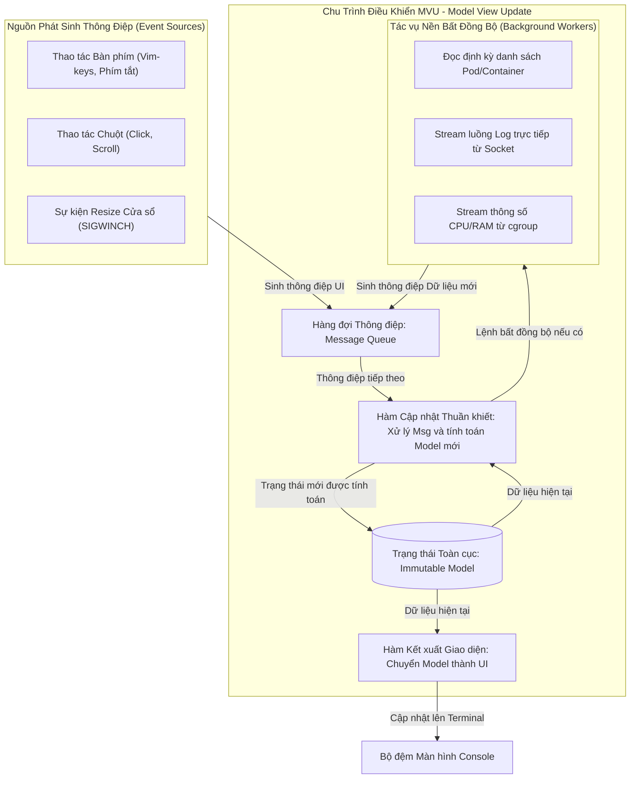

# ĐIỀU TRA KỸ THUẬT 03: KIẾN TRÚC F# & QUẢN LÝ TRẠNG THÁI (MVU / ELMISH)
## DỰ ÁN: PODMAN-FUI

- **Mã tài liệu:** INV-03-FSHARP-STATE
- **Trạng thái:** Hoàn thành điều tra
- **Mục tiêu:** Phân tích kiến trúc luồng dữ liệu một chiều (Model-View-Update), mô hình dữ liệu bất biến (Immutability), và cơ chế đồng bộ hóa bất đồng bộ giữa tiến trình nền (Socket Stream) và luồng giao diện (UI Thread).

---

## 1. TẠI SAO CHỌN F# & KIẾN TRÚC MVU CHO TUI CONTAINER TOOLING?

### 1.1. Những Thách thức của Ứng dụng TUI Đa Luồng
Một công cụ quản lý container thời gian thực như `podman-FUI` đối mặt với các vấn đề kỹ thuật phức tạp:
- **Xung đột luồng (Race Conditions):** Luồng giao diện đang vẽ danh sách container trong khi một luồng background khác vừa nhận được thông báo một container bị `Exited` hoặc bị xóa.
- **Trạng thái rác (Invalid States):** Nhiều biến cờ trạng thái (`isRunning`, `isPaused`, `hasError`, `isRestarting`) có thể tạo ra các tổ hợp trạng thái vô lý (ví dụ: vừa `isPaused` vừa `isRestarting`).
- **Nghẽn giao diện (UI Freeze):** Việc đọc stream log dung lượng lớn hoặc stream stats từ Unix Socket nếu không được cô lập hoàn toàn sẽ làm đơ bàn phím và chuột của người dùng.

### 1.2. Giải pháp của F#: Lập trình Hàm & Bất biến (Immutability)
- **Dữ liệu Bất biến (Immutable Data by Default):** Mọi cấu trúc dữ liệu mô tả trạng thái (Model) của ứng dụng đều là bất biến. Khi có sự thay đổi, một bản sao trạng thái mới được tạo ra mà không làm thay đổi bản cũ, loại bỏ 100% lỗi xung đột dữ liệu giữa các luồng.
- **Hợp không giao (Discriminated Unions):** Cho phép mô hình hóa trạng thái hệ thống một cách chính xác tuyệt đối. Một container chỉ có thể ở một trạng thái duy nhất tại một thời điểm (`Running`, `Exited`, `Paused`, hoặc `Created`), loại bỏ hoàn toàn các tổ hợp cờ trạng thái mâu thuẫn.
- **Kiểm tra Toàn diện tại Thời điểm Biên dịch (Exhaustive Pattern Matching):** Trình biên dịch F# bắt buộc người phát triển phải xử lý đầy đủ mọi trường hợp có thể xảy ra của thông điệp (Message) và trạng thái, không để sót bất kỳ kịch bản lỗi nào khi runtime.

---

## 2. CHU TRÌNH MODEL-VIEW-UPDATE (ELMISH PATTERN)

Kiến trúc cốt lõi của `podman-FUI` tuân thủ nguyên lý luồng dữ liệu một chiều (Unidirectional Data Flow):

### 2.1. Cấu trúc Mô hình Trạng thái (The Model)
Mô hình trạng thái đại diện cho toàn bộ "sự thật duy nhất" (Single Source of Truth) của ứng dụng tại một thời điểm:
- **Ngữ cảnh Điều hướng:** Danh mục đang được chọn (`Pods`, `Containers`, `Images`, `Volumes`, `Networks`), Tab chi tiết đang mở (`Logs`, `Stats`, `Inspect`, `Top`, `Env`).
- **Dữ liệu Thực thể:** Danh sách các Pod, danh sách các Container, thông tin Host Podman.
- **Tiêu điểm & Lựa chọn:** Chỉ số phần tử đang được chọn (Index), danh sách các phần tử được chọn hàng loạt (Multi-select set).
- **Bộ đệm Dữ liệu Thời gian thực:**
  - Bộ đệm vòng tròn các dòng Log (Ring Buffer giới hạn tối đa 2000 dòng để bảo vệ RAM).
  - Lịch sử mẫu đo CPU / RAM (Chuỗi 30 giá trị phần trăm phục vụ vẽ Sparkline).
- **Trạng thái Tương tác:** Trạng thái ô tìm kiếm (chuỗi lọc filter), trạng thái hộp thoại modal (đang mở hộp thoại xác nhận xóa, form tạo pod mới, hay thông báo lỗi).

### 2.2. Hệ thống Thông điệp (The Messages)
Mọi biến cố trong hệ thống đều được chuẩn hóa thành các thông điệp có định kiểu rõ ràng, phân loại thành hai nhóm chính:
1. **Thông điệp do Người dùng Tương tác (User Action Messages):**
   - Chuyển danh mục: `SelectCategory(CategoryType)`
   - Di chuyển danh sách: `NavigateUp`, `NavigateDown`, `NavigateFirst`, `NavigateLast`
   - Chuyển tab chi tiết: `SelectDetailTab(TabType)`
   - Hành động ngữ cảnh: `RequestStartEntity`, `RequestStopEntity`, `RequestRestartEntity`, `RequestDeleteEntity`
   - Thao tác bộ lọc: `UpdateFilterQuery(string)`, `ClearFilter`
   - Thay đổi kích thước: `TerminalResized(Width, Height)`
2. **Thông điệp do Hệ thống / Tác vụ Bất đồng bộ (System & Async Messages):**
   - Kết quả nạp danh sách: `ContainersLoaded(Result<ContainerList, Error>)`
   - Nhận một đoạn log mới: `LogChunkArrived(Channel, LogLine)`
   - Nhận mẫu số liệu metric mới: `StatsTickArrived(CpuPercent, MemoryBytes, NetIO)`
   - Sự cố socket: `SocketConnectionLost(ErrorMessage)`
   - Khôi phục socket: `SocketReconnected`

### 2.3. Hàm Cập nhật Thuần khiết (The Update Function)
- Nhận đầu vào: Thông điệp hiện tại (`Msg`) và Trạng thái hiện tại (`Model`).
- Xử lý: Sử dụng Pattern Matching để kiểm tra loại thông điệp, tính toán trạng thái mới mà **hoàn toàn không tạo ra hiệu ứng phụ (Side-effects)**.
- Đầu ra: Trả về một bộ đôi `(Model mới, Danh sách Lệnh bất đồng bộ cần kích hoạt - Cmd)`.
  - Ví dụ: Khi nhận thông điệp `RequestStopEntity`, hàm Update chuyển cờ trạng thái của container thành `Stopping`, đồng thời phát sinh một `Cmd` gọi API Stop xuống Socket của Podman.

---

## 3. CƠ CHẾ ĐỒNG BỘ HÓA ĐA LUỒNG & TRÁNH NGHẼN UI

### 3.1. Hộp thư Thông điệp (Actor Model / MailboxProcessor)
Để xử lý hàng trăm sự kiện mỗi giây từ các luồng stream mà không làm khóa vòng lặp giao diện:
- Mỗi tác vụ chạy nền (Background Task) kết nối socket hoạt động độc lập và đẩy thông điệp vào một **Hộp thư (MailboxProcessor)** an toàn luồng (Thread-safe FIFO Queue).
- MailboxProcessor xử lý tuần tự từng thông điệp theo thứ tự đến, đảm bảo trạng thái ứng dụng luôn nhất quán.

### 3.2. Đồng bộ hóa về Luồng Giao diện (UI Synchronization Context)
- Trong môi trường `Terminal.Gui`, việc vẽ màn hình phải được thực thi độc quyền trên **UI Main Thread**.
- Bất kỳ khi nào một tác vụ nền (như đọc log từ socket) muốn cập nhật giao diện:
  - Thông điệp được chuyển vào hàng đợi điều phối thông qua cơ chế `Application.Invoke(Action)`.
  - Vòng lặp chính của Terminal.Gui sẽ lấy hành động đó ra thực thi an toàn trong chu kỳ render kế tiếp, loại bỏ hoàn toàn các lỗi xung đột tài nguyên màn hình (Cross-thread UI Violation).

---

## 4. CHIẾN LƯỢC QUẢN LÝ BỘ NHỚ ĐỆM (CACHE & MEMORY STRATEGY)

Để đảm bảo yêu cầu phi chức năng về mức tiêu thụ bộ nhớ **RAM < 45MB** trong điều kiện bình thường và **< 80MB** khi tải nặng:

1. **Bộ đệm Log Vòng tròn (Circular Ring Buffer):**
   - Không lưu trữ toàn bộ lịch sử log của container vào bộ nhớ.
   - Chỉ giữ tối đa `N` dòng gần nhất (mặc định 2000 dòng). Khi vượt quá giới hạn, các dòng log cũ nhất tự động bị ghi đè/giải phóng mà không gây áp lực cho Garbage Collector (GC).
2. **Bộ đệm Metric Cố định:**
   - Dữ liệu Sparkline chỉ lưu đúng 30 - 60 điểm dữ liệu phần trăm kiểu số nguyên/thực cho mỗi container đang được theo dõi trực tiếp. Khi người dùng chuyển sang container khác, hệ thống hủy đăng ký stream stats của container cũ để tiết kiệm tài nguyên CPU.
3. **Lazy Loading cho Dữ liệu Chi tiết (Inspect Data):**
   - Chỉ gọi API `inspect` chi tiết khi người dùng thực sự chuyển sang Tab `Inspect`. Không tự ý nạp trước toàn bộ JSON inspect của tất cả container vào bộ nhớ.

---

## 5. KẾT LUẬN & ĐỀ XUẤT CHO BƯỚC THIẾT KẾ (DESIGN)

1. **Tách biệt rõ rệt ba tầng:**
   - Tầng Dữ liệu Miền (Domain Model & Messages): Hoàn toàn độc lập, không tham chiếu đến thư viện UI hay Socket.
   - Tầng Hạ tầng (Infrastructure/Socket Client): Chỉ đảm nhiệm việc gọi Unix Socket và phát sinh thông điệp.
   - Tầng Trình diễn (Presentation/UI View): Nhận Model từ MVU và render ra các component của Terminal.Gui.
2. **Tận dụng tối đa kiểu dữ liệu F#:** Khai báo toàn bộ cấu trúc trạng thái bằng F# Record Types và Discriminated Unions để trình biên dịch bảo vệ tính toàn vẹn của ứng dụng ngay từ khâu thiết kế.
