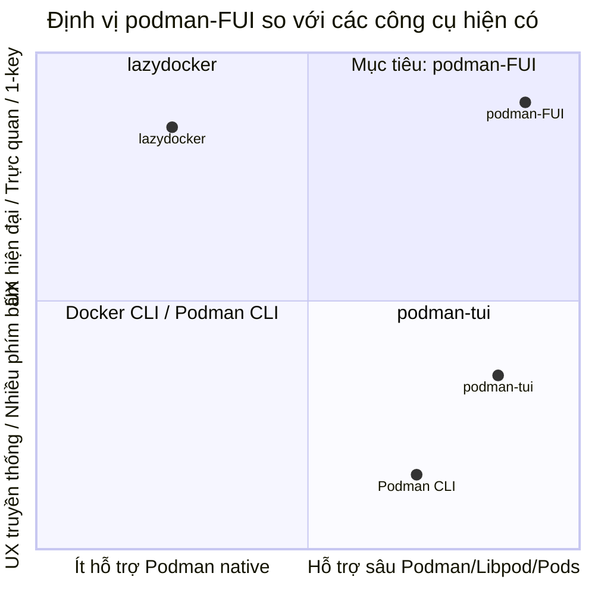
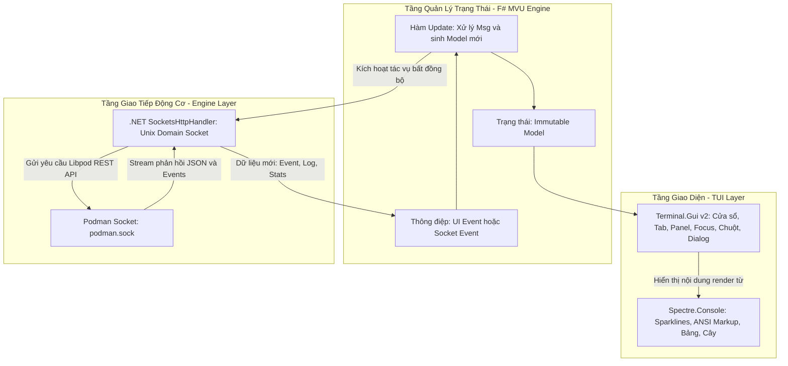

# TÀI LIỆU ĐẶC TẢ YÊU CẦU PHẦN MỀM (SRS)
## DỰ ÁN: PODMAN-FUI (F# TERMINAL USER INTERFACE FOR PODMAN)

- **Mã tài liệu:** SRS-PODMAN-FUI-01
- **Phiên bản:** 1.1.0
- **Trạng thái:** Bản thảo đề xuất kiến trúc & yêu cầu (Draft)
- **Tác giả:** Kỹ sư thiết kế hệ thống
- **Mục tiêu nền tảng:** Linux (Debian, Ubuntu, Fedora, RHEL, Rocky Linux, Arch Linux)
- **Ngôn ngữ chủ đạo:** F# (.NET 8 / .NET 10 LTS)

---

## 1. TỔNG QUAN DỰ ÁN (PROJECT OVERVIEW)

### 1.1. Mục đích tài liệu
Tài liệu này xác định các yêu cầu chức năng (Functional Requirements), yêu cầu phi chức năng (Non-Functional Requirements), kiến trúc kỹ thuật và công nghệ (Tech Stack) cho dự án **podman-FUI**. Đây là cơ sở kỹ thuật để đội ngũ phát triển tiến hành giai đoạn thiết kế kiến trúc (`2.Design`) và triển khai mã nguồn (`3.Progress`).

### 1.2. Bối cảnh & Vấn đề (Problem Statement)
- **Podman** ngày càng trở thành chuẩn mực công nghệ container thay thế Docker trong môi trường Linux (đặc biệt trên các bản phân phối Red Hat/Fedora và Debian/Ubuntu) nhờ cơ chế **Rootless** (không cần quyền root), kiến trúc **Daemonless**, và hỗ trợ chuẩn **Pods** (tương thích Kubernetes).
- Hiện tại, công cụ TUI chính thức là **`podman-tui`** (viết bằng Go) có đầy đủ tính năng nhưng trải nghiệm người dùng (UX) còn mang tính điều hướng form truyền thống, thao tác qua nhiều tầng menu, thiếu biểu đồ tài nguyên trực quan thời gian thực.
- Ngược lại, **`lazydocker`** (viết bằng Go) sở hữu UX xuất sắc với triết lý "1-keypress away", hiển thị dashboard đa bảng, biểu đồ ASCII/Sparklines sống động và stream log tiện lợi; nhưng lại bị giới hạn trong tư duy Docker (không có khái niệm Pods, không hỗ trợ chuyên sâu các endpoint Libpod của Podman).
- **podman-FUI** ra đời nhằm dung hòa hai thế giới: Mang sức mạnh quản lý toàn diện của `podman-tui` kết hợp với trải nghiệm mượt mà, thông minh của `lazydocker`, được hiện thực hóa bằng ngôn ngữ hàm **F#** và bộ đôi thư viện TUI hiện đại **Terminal.Gui** + **Spectre.Console**.

### 1.3. Định vị sản phẩm (Product Positioning)



---

## 2. PHÂN TÍCH ĐỐI CHIẾU THAM KHẢO (BENCHMARKING)

| Tiêu chí | `podman-tui` (Go) | `lazydocker` (Go) | Mục tiêu `podman-FUI` (F#) |
| :--- | :--- | :--- | :--- |
| **Công nghệ UI** | `rivo/tview` & `gdamore/tcell` | `jroimartin/gocui` | **Terminal.Gui v2** + **Spectre.Console** |
| **Mô hình lập trình** | Hướng đối tượng / Thủ tục (Go) | Thủ tục / Quản lý view (Go) | **Functional-first (F#)**, Elmish / MVU Pattern |
| **Quản lý Pods (Kubernetes-like)** | Đầy đủ (Tạo, xoá, start, pause, inspect) | Không hỗ trợ | **Hỗ trợ đầy đủ hạng nhất (First-class citizen)** |
| **Quản lý Container / Images** | Rất chi tiết, nhiều form thiết lập | Trực quan, tập trung vào trạng thái | **Kết hợp: Bảng trạng thái nhanh + Dialog chi tiết** |
| **Biểu đồ Realtime Stats** | Dạng text / bảng số liệu tĩnh | Sparkline / ASCII bar chart sống động | **Spectre.Console Sparklines / BarCharts realtime** |
| **Stream Logs** | Xem log theo modal riêng | Tab log tích hợp ngay trên dashboard | **Tab log tích hợp sẵn, auto-scroll, lọc từ khóa** |
| **Hỗ trợ chuột (Mouse)** | Cơ bản | Rất tốt (click chọn panel, cuộn) | **Hoàn chỉnh (Click chọn, focus, context menu, scroll)** |
| **Cơ chế gọi API** | `podman/pkg/bindings` (Go SDK) | Docker Engine API client | **.NET SocketsHttpHandler -> Podman Unix Socket / REST** |

---

## 3. THIẾT LẬP TECH STACK & KIẾN TRÚC HỆ THỐNG

### 3.1. Ngôn ngữ & Nền tảng: F# trên .NET 8 / .NET 10 LTS
- **Lý do chọn F#:**
  - **Mô hình Dữ liệu Bất biến (Immutability):** Đảm bảo an toàn luồng dữ liệu khi stream log và metric liên tục chạy ở background.
  - **Pattern Matching & Algebraic Data Types (Discriminated Unions):** Mô hình hóa trạng thái của Container (`Running`, `Exited(code)`, `Paused`, `Dead`) và các loại Message UI một cách chặt chẽ, loại bỏ hoàn toàn lỗi `NullReferenceException`.
  - **Async Workflows & AsyncSeq:** Xử lý bất đồng bộ mượt mà khi đọc stream từ Unix Socket mà không gây nghẽn UI loop.
  - **Kiến trúc MVU (Model-View-Update / Elmish):** Luồng dữ liệu một chiều rõ ràng, cực kỳ phù hợp cho ứng dụng TUI phức tạp nhiều trạng thái.

### 3.2. Bộ đôi thư viện giao diện: Terminal.Gui + Spectre.Console
Sự kết hợp này phân chia trách nhiệm rõ ràng (Separation of Concerns):
1. **Terminal.Gui (Gui.cs v2):**
   - Đóng vai trò **Window Manager & Input Engine**: Quản lý bố cục màn hình (Layouts, Splitter, TabView), hệ thống cửa sổ, Modal Dialog, quản lý tiêu điểm bàn phím (Focus navigation), bắt sự kiện chuột (Mouse clicks, scrolling) và menu phím tắt.
2. **Spectre.Console:**
   - Đóng vai trò **Rich Content & Graphics Renderer**: Định dạng văn bản với màu sắc phong phú (ANSI/TrueColor), hiển thị bảng dữ liệu (Tables), biểu đồ cây quan hệ Pod-Container (Trees), đồ thị chỉ số Sparklines và thanh tiến trình (BarCharts).



### 3.3. Tầng giao tiếp Podman Engine (Network & Protocol)
- **Cơ chế kết nối:**
  - Kết nối trực tiếp vào Unix Domain Socket của Podman thông qua `System.Net.Sockets.SocketsHttpHandler` của .NET.
  - Tự động nhận diện chế độ:
    - **Rootless:** `$XDG_RUNTIME_DIR/podman/podman.sock` (thường là `/run/user/<UID>/podman/podman.sock`).
    - **Rootful:** `/run/podman/podman.sock`.
    - **Remote:** Kết nối qua SSH Tunnel hoặc TCP endpoint khi có cấu hình `CONTAINER_HOST`.
- **API Endpoints sử dụng (Podman Libpod API):**
  - `/v4.0.0/libpod/pods/json`: Liệt kê và kiểm soát Pod.
  - `/v4.0.0/libpod/containers/json`: Liệt kê và quản lý Container.
  - `/v4.0.0/libpod/containers/{name}/stats?stream=true`: Stream dữ liệu CPU/RAM/IO phục vụ biểu đồ realtime.
  - `/v4.0.0/libpod/containers/{name}/logs?follow=true&stdout=true&stderr=true`: Stream log realtime.
  - `/v4.0.0/libpod/images/json`: Quản lý hình ảnh container.
  - `/v4.0.0/libpod/volumes/json`: Quản lý ổ đĩa lưu trữ.
  - `/v4.0.0/libpod/networks/json`: Quản lý mạng container.
  - `/v4.0.0/libpod/system/df`: Thống kê dung lượng ổ đĩa.

---

## 4. BỐ CỤC MÀN HÌNH & TRẢI NGHIỆM NGƯỜI DÙNG (UX/LAYOUT DESIGN)

### 4.1. Bố cục tổng thể & Khả năng Co giãn Động (Responsive & Scalable Dashboard)
- **Cơ chế Co giãn Tự động (Responsive Auto-scaling - Non-fixed Resolution):**
  - Giao diện **không cố định độ phân giải (non-fixed)** mà hoàn toàn thích ứng linh hoạt (responsive) theo kích thước cửa sổ của trình giả lập terminal (thông qua cơ chế `Dim.Percent`, `Dim.Fill`, `Pos.Percent` của Terminal.Gui v2).
  - Tự động bắt sự kiện thay đổi kích thước cửa sổ terminal (`SIGWINCH` / Terminal Resize Event) và tái tính toán tỷ lệ các panel ngay lập tức:
    - **Màn hình lớn / tiêu chuẩn (>= 100 cột):** Chế độ song song Master-Detail (Panel danh sách thực thể bên trái chiếm ~40-45%, Panel chi tiết & giám sát bên phải chiếm ~55-60%).
    - **Màn hình trung bình (80 - 99 cột):** Tự động tối ưu độ rộng cột dữ liệu, rút gọn chuỗi trạng thái và format log cho vừa vặn.
    - **Màn hình nhỏ / hẹp (< 80 cột hoặc chiều cao < 24 dòng):** Tự động chuyển đổi linh hoạt sang chế độ Xếp chồng (Stacked Mode) hoặc chế độ một khung nhìn kết hợp phím tắt chuyển nhanh để không bị vỡ giao diện.

- **Minh họa Giao diện Mẫu (Sample UI - English Default):**

```
+----------------------------------------------------------------------------------------------------+
| [1] Pods (3)  |  [2] Containers (8)  |  [3] Images (12)  |  [4] Volumes (4)  |  [5] Networks (3)   |  <- Top Bar
+---------------------------------------------------+------------------------------------------------+
| ENTITIES [Containers - Focus: 2]                  | DETAILS & MONITORING                           |
|                                                   | [Logs]  [Live Stats]  [Inspect]  [Top]  [Env]  |
| > [x] web-backend      Up (healthy)  8080:80      +------------------------------------------------+
|   [ ] redis-cache      Up            6379:6379    | CPU: [||||||||||..........] 34.2%              |
|   [!] db-postgres      Restarting...              | Sparkline:  ▂▃▅▆▇▆▅▃▂ ▂▃▄▅                     |
|                                                   | Memory: [||||||||||||||||....] 512MB / 1024MB  |
|                                                   | Sparkline: ▅▅▅▅▆▆▆▆▇▇▇▇▇▇▇▇                    |
|                                                   | Net I/O: 14.2MB / 8.5MB  | Block I/O: 120KB    |
|                                                   +------------------------------------------------+
|                                                   | RECENT LOGS:                                   |
|                                                   | 10:30:15 [INFO] Server started on :8080        |
|                                                   | 10:30:20 [DEBUG] Connected to postgres pool    |
+---------------------------------------------------+------------------------------------------------+
| F1: Help  |  Space: Start/Stop  |  d: Delete  |  r: Restart  |  /: Filter  |  m: Menu  |  q: Quit  |  <- Footer
+----------------------------------------------------------------------------------------------------+
```

### 4.2. Hệ thống phím tắt (Keybindings)
Tối ưu hóa thao tác 1-chạm (nhanh gọn như `lazydocker` kết hợp các phím chức năng của `podman-tui`):

- **Điều hướng:**
  - `1`, `2`, `3`, `4`, `5`: Nhảy nhanh đến các bảng: Pods, Containers, Images, Volumes, Networks.
  - `h`, `j`, `k`, `l` hoặc `Mũi tên`: Di chuyển lên/xuống danh sách và chuyển panel trái/phải.
  - `Tab` / `Shift+Tab`: Chuyển đổi tiêu điểm giữa các khung nhìn.
  - `[` / `]`: Chuyển tab chi tiết bên phải (Logs -> Stats -> Inspect -> Top -> Env).
- **Hành động tức thời (Context Actions):**
  - `Space` / `s`: Dừng/Chạy (Stop/Start) thực thể đang chọn.
  - `r`: Khởi động lại (Restart).
  - `p`: Tạm dừng (Pause / Unpause).
  - `d`: Xóa (Delete/Remove) - Luôn hiển thị modal xác nhận an toàn.
  - `e`: Mở shell tương tác bên trong container (`podman exec -it <container> sh`).
  - `b`: Mở menu thao tác hàng loạt (Bulk actions: Prune, Start all, Stop all).
  - `/`: Mở ô tìm kiếm / lọc nhanh tức thì (Fuzzy filtering).
  - `m` hoặc `F10`: Mở bảng chọn lệnh nâng cao (Command Menu Palette).
  - `q` hoặc `Ctrl+C`: Thoát ứng dụng an toàn.

---

## 5. YÊU CẦU CHỨC NĂNG (FUNCTIONAL REQUIREMENTS)

### FR1: Quản lý Pods (Podman-Native Feature)
- **FR1.1:** Liệt kê danh sách tất cả các Pod (tên, ID, trạng thái, số lượng container bên trong, port mapping).
- **FR1.2:** Hiển thị cấu trúc dạng cây (Spectre Tree) các container thuộc từng Pod.
- **FR1.3:** Thực hiện các hành động trên Pod: Tạo Pod mới (Form modal), Start, Stop, Pause, Unpause, Restart, Delete Pod (kèm tuỳ chọn `force`).
- **FR1.4:** Xem tổng hợp log của toàn bộ các container trong Pod đó.

### FR2: Quản lý Containers
- **FR2.1:** Hiển thị danh sách container đầy đủ với màu sắc phân biệt trạng thái (`Running`, `Exited`, `Paused`, `Created`).
- **FR2.2:** Thực hiện thao tác nhanh: Start, Stop, Restart, Kill, Pause, Resume, Remove.
- **FR2.3:** Tích hợp tính năng Attach/Exec Shell: Tạm dừng UI để nhường terminal cho phiên làm việc `sh/bash`, tự động khôi phục UI khi người dùng thoát shell.
- **FR2.4:** Xem chi tiết JSON Inspect với tô màu cú pháp (Syntax highlighting).

### FR3: Realtime Logs & Log Streaming
- **FR3.1:** Tự động bắt đầu stream log khi chọn một container/pod.
- **FR3.2:** Hỗ trợ tính năng tự động cuộn (Auto-scroll) theo log mới, có thể ngắt cuộn khi người dùng cuộn ngược lên xem lịch sử.
- **FR3.3:** Bật/tắt hiển thị Timestamp.
- **FR3.4:** Tìm kiếm chuỗi văn bản trong luồng log.

### FR4: Biểu đồ giám sát thời gian thực (Realtime Metrics & Graphs)
- **FR4.1:** Sử dụng `stats` stream từ Podman để lấy thông số CPU %, Memory %, Network I/O (Tx/Rx), Block I/O theo chu kỳ (mặc định 1.5 giây).
- **FR4.2:** Vẽ đồ thị Sparkline trực quan (sử dụng ký tự Unicode block ` ▂▃▄▅▆▇█`) cho lịch sử tải của CPU và RAM.
- **FR4.3:** Hiển thị thanh đo Gauge/BarChart màu sắc (Xanh: < 60%, Vàng: 60-85%, Đỏ: > 85%).

### FR5: Quản lý Images
- **FR5.1:** Liệt kê danh sách image cục bộ (Repository, Tag, Image ID, Size, Created Time).
- **FR5.2:** Tìm kiếm image trên Registry (Docker Hub, Quay.io, Red Hat Registry).
- **FR5.3:** Kéo image về (Pull Image) có thanh tiến trình hiển thị layer download.
- **FR5.4:** Xem các layer lịch sử của image (Image Ancestor Layers / History).
- **FR5.5:** Xóa image và dọn dẹp image thừa (`Prune unused images`).

### FR6: Quản lý Volumes & Networks
- **FR6.1:** Liệt kê các Volume và Network hiện có trên máy.
- **FR6.2:** Xem thông tin inspect (Driver, Mountpoint, Subnet, Gateway).
- **FR6.3:** Dọn dẹp các Volume/Network mồ côi (không còn gắn với container nào).

### FR7: Quản trị Hệ thống & Dọn dẹp (System & Disk Usage)
- **FR7.1:** Hiển thị thông tin máy chủ Podman (OS, Kernel, Cgroup version, Arch, Storage Driver, Rootless mode).
- **FR7.2:** Thống kê dung lượng ổ đĩa (`df`) chiếm dụng bởi Containers, Images, Volumes, Build Cache.
- **FR7.3:** Tính năng `System Prune` tổng thể với hộp thoại cảnh báo hai bước để tránh mất mát dữ liệu ngoài ý muốn.

---

## 6. YÊU CẦU PHI CHỨC NĂNG (NON-FUNCTIONAL REQUIREMENTS)

### NFR1: Khả năng tương thích hệ điều hành & Terminal
- **Hệ điều hành mục tiêu:**
  - **Hệ Debian:** Debian 11/12, Ubuntu 22.04/24.04 LTS, Linux Mint.
  - **Hệ Fedora/RHEL:** Fedora 39/40/41, RHEL 8/9, CentOS Stream, Rocky Linux, AlmaLinux.
- **Trình giả lập Terminal hỗ trợ:** GNOME Terminal, Konsole, Alacritty, Kitty, WezTerm, xterm, tmux, Windows Terminal (khi SSH vào Linux).
- **Màu sắc:** Tự động nhận diện và hỗ trợ TrueColor (24-bit), fallback về 256 colors hoặc 16 colors tiêu chuẩn nếu terminal không hỗ trợ.
- **Khả năng co giãn độ phân giải (Dynamic Screen Scaling):** Bố cục giao diện hoàn toàn thích ứng động (non-fixed resolution), tự động co giãn và bố trí lại các panel khi kích thước cửa sổ terminal thay đổi (`SIGWINCH`), hỗ trợ mượt mà từ màn hình nhỏ (tối thiểu 80x24) cho tới toàn màn hình (Full HD, 2K, 4K hoặc môi trường chia split-pane trong tmux).

### NFR2: Hiệu năng & Mức tiêu thụ tài nguyên
- **Thời gian khởi động:** < 250ms từ khi gõ lệnh đến khi render xong dashboard đầu tiên.
- **Mức chiếm dụng bộ nhớ (RAM):**
  - < 45 MB khi ở trạng thái hoạt động bình thường.
  - < 80 MB khi tải buffer log lớn (tự động giới hạn vòng đệm log tối đa 2000 dòng).
- **Mức chiếm dụng CPU:** < 1% ở trạng thái nhàn rỗi (idle), tối đa 3-5% khi đang cập nhật stream metrics liên tục.

### NFR3: Đóng gói & Phân phối (Packaging & Deployment)
- Không bắt buộc người dùng cuối phải cài đặt .NET SDK hoặc .NET Runtime trên máy.
- Xuất bản dưới dạng **Single-file Self-contained Executable** (sử dụng Native AOT hoặc SingleFile Publish của .NET).
- Tạo sẵn các gói cài đặt chuẩn:
  - **`.deb`** cho Debian/Ubuntu.
  - **`.rpm`** cho Fedora/RHEL/CentOS.
  - **Tarball (`.tar.gz`)** chứa binary độc lập chỉ việc giải nén và chạy.

### NFR4: Độ tin cậy & Xử lý lỗi (Resilience)
- Khi khởi động, nếu `podman.socket` chưa chạy, ứng dụng không được crash mà phải hiển thị màn hình hướng dẫn thân thiện:
  ```text
  [!] Không thể kết nối tới Podman Socket tại: /run/user/1000/podman/podman.sock
  
  Hướng dẫn khắc phục:
  Vui lòng khởi động socket bằng lệnh:
    $ systemctl --user enable --now podman.socket
  
  Nhấn [r] để thử kết nối lại | Nhấn [q] để thoát
  ```
- Tự động kết nối lại khi socket bị ngắt quãng ngắn hạn.

### NFR5: Hỗ trợ Đa ngôn ngữ & Bản địa hóa (i18n & Localization)
- **Quy hoạch ngôn ngữ hỗ trợ:**
  - Tiếng Anh (**EN** - English)
  - Tiếng Việt (**VI** - Vietnamese)
  - Tiếng Nhật (**JA** - Japanese)
- **Phạm vi thực thi ở giai đoạn hiện tại (Current Execution Scope):**
  - Toàn bộ giao diện người dùng (UI text, menu, button, status bar, dialog), thông báo trạng thái và mã lỗi trong mã nguồn thực thi **chỉ tập trung triển khai và kiểm thử hoàn chỉnh bằng Tiếng Anh (EN)** làm ngôn ngữ mặc định.
- **Kiến trúc thiết kế sẵn sàng cho i18n:**
  - Thiết kế trừu tượng hóa toàn bộ chuỗi hiển thị thành các khóa định danh (Resource Keys / Localization Dictionary), không hardcode chuỗi ký tự trực tiếp trong code UI.
  - Đảm bảo trong tương lai khi kích hoạt `VI` và `JA`, hệ thống chỉ cần nạp file resource tương ứng mà không phải can thiệp hay sửa đổi logic nghiệp vụ.
- **Ngôn ngữ tài liệu dự án (Documentation):**
  - Toàn bộ tài liệu đặc tả (SRS), tài liệu thiết kế kiến trúc (`2.Design`), nhật ký tiến độ (`3.Progress`) và tài liệu nội bộ tiếp tục duy trì sử dụng **Tiếng Việt** bình thường.

---

## 7. KẾ HOẠCH & LỘ TRÌNH TRIỂN KHAI (ROADMAP & MILESTONES)

Kế hoạch phát triển dự án được tổ chức thành 6 cột mốc (Milestones) lớn rõ ràng:

### Milestone 1: Khảo sát chi tiết & Thiết lập Nền tảng cốt lõi
- Khảo sát các thông số kỹ thuật của Podman Libpod REST API qua Unix Domain Socket.
- Khởi tạo F# Solution (.NET 8/10), thiết lập cấu hình tích hợp giữa Terminal.Gui v2 và Spectre.Console.
- Hoàn thành PoC (Proof of Concept) kết nối và đọc thông tin máy chủ Podman từ `/run/user/<UID>/podman/podman.sock`.
- Xây dựng kiến trúc trừu tượng hóa chuỗi giao diện (Localization Resource Structure) chuẩn bị cho EN/VI/JA.

### Milestone 2: Xây dựng Kiến trúc MVU & Quản lý Container (Core MVP)
- Xây dựng khung kiến trúc Model-View-Update (Elmish style) trên F#.
- Thiết kế bố cục Dashboard chính (đa panel) với Terminal.Gui.
- Hiện thực hóa tính năng liệt kê danh sách Container với đầy đủ trạng thái và thông tin cơ bản.
- Triển khai các tác vụ quản lý tức thời cho Container: Start, Stop, Restart, Pause, Kill, Remove (kèm hộp thoại xác nhận an toàn).
- Hiện thực hóa cơ chế tạm dừng UI để nhường terminal thực thi Exec Shell (`sh`/`bash`) bên trong container.

### Milestone 3: Giám sát Trực quan hóa Realtime & Stream Logs
- Xây dựng bộ đọc Stream Log bất đồng bộ từ Podman socket với tính năng tự động cuộn (Auto-scroll) và tìm kiếm chuỗi văn bản.
- Tích hợp endpoint `/stats` để nhận dữ liệu tài nguyên định kỳ (CPU, Memory, Network I/O, Block I/O).
- Sử dụng Spectre.Console để vẽ đồ thị Sparklines (` ▂▃▄▅▆▇█`) và thanh đo Gauge màu sắc cập nhật theo thời gian thực.
- Xây dựng tab xem JSON Inspect với tô màu cú pháp.

### Milestone 4: Triển khai các Tính năng Podman Chuyên sâu (Podman-Native)
- **Quản lý Pods:** Liệt kê danh sách Pod, hiển thị cây container trong từng Pod, các thao tác Start, Stop, Pause, Restart, Xóa Pod và tạo Pod mới.
- **Quản lý Images:** Liệt kê image cục bộ, xóa image, dọn dẹp rác (Prune), hiển thị các layer lịch sử của image, tính năng kéo image mới (Pull Image) kèm thanh tiến trình.
- **Quản lý Volumes & Networks:** Danh sách, xem cấu hình chi tiết (Inspect), dọn dẹp các volume/network mồ côi.
- **Quản trị Hệ thống:** Xem thông số host, thống kê dung lượng ổ đĩa (`df`) và System Prune tổng thể.

### Milestone 5: Tối ưu hóa Trải nghiệm Người dùng (UX Polish)
- Tối ưu hóa hệ thống phím tắt: Hỗ trợ đầy đủ bộ phím Vim (`h, j, k, l`), các phím số `1..5` để nhảy panel tức thì, bảng menu lệnh (`m` / `F10`), và phím lọc nhanh (`/`).
- Hoàn thiện hỗ trợ chuột: Bắt sự kiện click chọn panel, click thực thể, cuộn bánh xe chuột (Mouse wheel scroll) trên danh sách và khung log.
- Xử lý các kịch bản lỗi: Màn hình hướng dẫn khi `podman.socket` chưa khởi động, tự động phục hồi kết nối socket khi có sự cố.

### Milestone 6: Đóng gói Phân phối & CI/CD
- Cấu hình xuất bản binary độc lập dạng Single-file Self-contained (không yêu cầu cài sẵn .NET SDK/Runtime trên máy người dùng cuối).
- Xây dựng quy trình đóng gói tự động cho hai họ Linux chính:
  - Gói cài đặt **`.deb`** cho hệ Debian / Ubuntu.
  - Gói cài đặt **`.rpm`** cho hệ Fedora / RHEL / CentOS.
  - File nén **`.tar.gz`** portable cho các bản phân phối Linux khác.
- Thiết lập quy trình kiểm thử tự động và phát hành qua GitHub Actions.

---

## 8. KẾT LUẬN & BƯỚC TIẾP THEO

Tài liệu SRS này xác lập toàn bộ nền tảng yêu cầu và mục tiêu tính năng của **podman-FUI**:
- Đưa F# trở thành ngôn ngữ xây dựng TUI hiệu năng cao, an toàn kiểu dữ liệu cho Linux Container tooling.
- Tận dụng sức mạnh chuyên biệt của **Terminal.Gui** cho kiến trúc cửa sổ tương tác và **Spectre.Console** cho chất lượng đồ họa terminal ANSI đỉnh cao.
- Mang lại trải nghiệm người dùng vượt trội kế thừa từ **LazyDocker**, đồng thời hỗ trợ trọn vẹn đặc trưng kiến trúc Podman từ **Podman-TUI**.
- Xác định rõ phạm vi giao diện thực thi bằng Tiếng Anh (EN) trong giai đoạn đầu, đồng thời chuẩn bị sẵn cấu trúc mở rộng cho Tiếng Việt (VI) và Tiếng Nhật (JA).

**Bước tiếp theo đề xuất:**
1. Tiến hành phân chia tài liệu thiết kế chi tiết kiến trúc thư mục mã nguồn và luồng MVU trong thư mục `docs/2.Design/`.
2. Khởi tạo F# Solution (`podman-FUI.sln`) và dự án Console F# để tiến hành kiểm thử PoC kết nối Socket.
