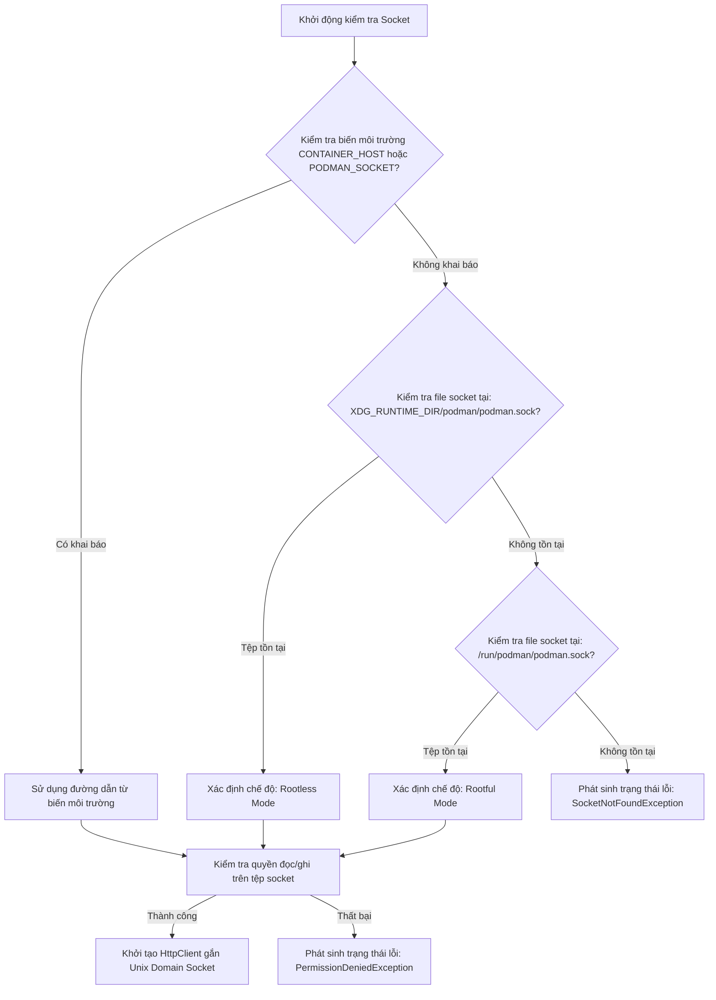

# BẢN THIẾT KẾ KỸ THUẬT BẰNG LỜI: MILESTONE 1
## THIẾT KẾ NỀN TẢNG SOLUTION F# & GIAO TIẾP UNIX DOMAIN SOCKET

- **Mã tài liệu:** DES-M1-FOUNDATION-SOCKET
- **Vị trí lưu trữ:** `docs/2.Design/Design_M1_Foundation_and_Socket.md`
- **Phiên bản:** 1.0.0
- **Trạng thái:** Bản thiết kế đã phê duyệt (Approved)
- **Tài liệu căn cứ:** 
  - [`SRS_podman-FUI.md`](../1.Investigation/SRS_podman-FUI.md)
  - [`01_Podman_Socket_and_API_Investigation.md`](../1.Investigation/01_Podman_Socket_and_API_Investigation.md)
- **Tài liệu tiến độ gắn kèm:** [`Milestone_1_Foundation_and_Investigation.md`](../3.Progress/Milestone_1_Foundation_and_Investigation.md)

---

## 1. MỤC TIÊU THIẾT KẾ
Tài liệu này đặc tả chi tiết bằng lời (Textual Specification) kiến trúc nền tảng cho Milestone 1 trước khi tiến hành viết mã:
1. Thiết kế phân rã cấu trúc thư mục mã nguồn và tổ chức Solution F# theo tiêu chuẩn Clean Architecture.
2. Thiết kế logic tầng giao tiếp Unix Domain Socket của Podman Engine bằng lời văn mô tả luồng dữ liệu, thuật toán tự động nhận diện socket, và cấu trúc hợp đồng dữ liệu (Data Contracts).
3. Thiết kế kịch bản xử lý ngoại lệ và luồng nghiệm thu chương trình thử nghiệm (PoC).

---

## 2. THIẾT KẾ CẤU TRÚC THƯ MỤC & TỔ CHỨC SOLUTION F#

### 2.1. Cấu trúc Cây Thư mục Dự án

```
podman-FUI/
├── docs/                               # Toàn bộ tài liệu dự án
│   ├── 1.Investigation/                # Khảo sát & SRS
│   ├── 2.Design/                       # Các bản thiết kế kỹ thuật bằng lời
│   └── 3.Progress/                     # Lộ trình & Theo dõi tiến độ
├── src/                                # Mã nguồn ứng dụng
│   ├── PodmanFUI.Domain/               # Tầng dữ liệu nghiệp vụ thuần F# (Không phụ thuộc bên ngoài)
│   ├── PodmanFUI.Infrastructure/       # Tầng hạ tầng: Giao tiếp Unix Socket, HTTP Client
│   ├── PodmanFUI.Presentation/         # Tầng giao diện: Terminal.Gui Views & Spectre Renderers
│   └── PodmanFUI.App/                  # Dự án Console chính: Điểm khởi chạy (Entry Point) & Vòng lặp MVU
├── tests/                              # Dự án kiểm thử tự động
│   └── PodmanFUI.Tests/                # Unit Test & Integration Test
├── packaging/                          # Kịch bản và tệp mẫu đóng gói .deb, .rpm
│   ├── deb/                            # Cấu trúc DEBIAN/control và script postinst
│   └── rpm/                            # RPM spec file
├── podman-FUI.sln                      # Tệp Solution quản lý chung của .NET
├── .gitignore                          # Cấu hình bỏ qua tệp tạm và tệp build
└── README.md                           # Giới thiệu dự án
```

### 2.2. Phân công Trách nhiệm từng Dự án (Separation of Concerns)

1. **`PodmanFUI.Domain` (Thư viện F# thuần khiết):**
   - Không chứa bất kỳ thư viện ngoài nào (kể cả thư viện UI lẫn HTTP).
   - Định nghĩa các kiểu dữ liệu cốt lõi (Record Types) và máy trạng thái (Discriminated Unions) cho các thực thể: Pod, Container, Image, Volume, Network, HostInfo.
   - Định nghĩa các giao diện trừu tượng (Interfaces) cho dịch vụ Socket.

2. **`PodmanFUI.Infrastructure` (Thư viện F# Hạ tầng):**
   - Phụ thuộc vào `PodmanFUI.Domain`.
   - Đảm nhiệm việc kết nối vật lý vào file Unix Domain Socket (`.sock`).
   - Xây dựng HTTP Client tùy biến sử dụng `SocketsHttpHandler` của .NET.
   - Thực hiện serialization / deserialization JSON giữa đối tượng F# và phản hồi của Libpod REST API.

3. **`PodmanFUI.Presentation` (Thư viện F# Giao diện):**
   - Phụ thuộc vào `PodmanFUI.Domain`.
   - Tham chiếu các gói NuGet giao diện: `Terminal.Gui` (v2) và `Spectre.Console`.
   - Chứa các User Controls, Custom Canvas, Bảng hiển thị, Cửa sổ Modal và Module chuyển đổi màu sắc ANSI.

4. **`PodmanFUI.App` (Chương trình Console F# thực thi):**
   - Dự án tích hợp đầu não, tham chiếu cả 3 dự án trên.
   - Chứa hàm `main` khởi chạy, bộ nạp tham số dòng lệnh (CLI arguments), cơ chế bắt tín hiệu hệ thống (`SIGWINCH`, `SIGINT`), và bộ điều phối vòng lặp Elmish MVU.

---

## 3. THIẾT KẾ CHI TIẾT TẦNG GIAO TIẾP UNIX DOMAIN SOCKET

### 3.1. Thuật toán Tự động Nhận diện Đường dẫn Socket (Auto-Discovery Flow)
Quy trình nhận diện đường dẫn socket được thiết kế tuần tự theo các bước ưu tiên:



- **Mô tả chi tiết các bước:**
  - **Bước 1 (Biến môi trường):** Đọc chuỗi kết nối từ `CONTAINER_HOST`. Nếu có tiền tố `unix://`, bóc tách đường dẫn file cục bộ.
  - **Bước 2 (Chế độ Rootless):** Truy vấn biến `$XDG_RUNTIME_DIR` (thường là `/run/user/<UID>`). Ghép chuỗi tạo thành `/run/user/<UID>/podman/podman.sock`. Kiểm tra sự tồn tại vật lý của file trên hệ thống tệp.
  - **Bước 3 (Chế độ Rootful):** Kiểm tra đường dẫn cố định của hệ thống `/run/podman/podman.sock`.
  - **Bước 4 (Xử lý khi không thấy):** Nếu cả 3 bước đều thất bại, trả về đối tượng lỗi có cấu trúc, chứa thông điệp hướng dẫn người dùng lệnh kích hoạt socket Systemd.

### 3.2. Thiết kế Cơ chế Kết nối Vật lý (Physical Connection Mechanics)
- Tầng hạ tầng không sử dụng địa chỉ IP hay cổng TCP mạng nội bộ, mà mở trực tiếp một kết nối luồng (Stream Socket) thuộc họ địa chỉ `AddressFamily.Unix` (AF_UNIX).
- Sử dụng cơ chế kết nối ủy thác (Custom Connect Callback) bên trong cấu hình `SocketsHttpHandler` của .NET.
- Khi một yêu cầu HTTP được phát đi, Handler tạo một socket Unix, thực hiện lệnh `Connect` trực tiếp tới tệp socket trên ổ cứng, và bọc socket đó vào một luồng dữ liệu mạng (`NetworkStream`) để truyền tải giao thức HTTP/1.1 tiêu chuẩn.
- Địa chỉ gốc (Base Address) của HTTP Client được đặt quy ước là `http://d/v4.0.0/libpod/` (trong đó `d` là tên máy chủ giả lập, vì giao tiếp Unix Socket không quan tâm đến tên miền hay IP).

---

## 4. THIẾT KẾ CẤU TRÚC HỢP ĐỒNG DỮ LIỆU (DATA CONTRACTS) CHO POC

Để phục vụ kiểm thử nghiệm thu PoC trong Milestone 1, cấu trúc dữ liệu phản hồi từ endpoint `GET /v4.0.0/libpod/info` được phân rã thành các hợp đồng dữ liệu sau:

### 4.1. Hợp đồng Thông tin Máy chủ Host (`HostInfo`)
- **Kiến trúc phần cứng & Hệ điều hành:** Chuỗi định danh kiến trúc (`Arch`: ví dụ `amd64`, `arm64`), Hệ điều hành (`OS`: `linux`), Phiên bản nhân Kernel (`Kernel`).
- **Phân hệ Quản lý Cgroup:**
  - Phiên bản Cgroup (`CgroupVersion`: chuỗi `v1` hoặc `v2`).
  - Trình quản lý Cgroup (`CgroupManager`: `systemd` hoặc `cgroupfs`).
  - Danh sách các bộ điều khiển được ủy quyền (`CgroupControllers`: mảng chuỗi gồm `cpu`, `memory`, `pids`).
- **Phân hệ Lưu trữ (Storage):**
  - Trình điều khiển lưu trữ (`GraphDriverName`: ví dụ `overlay`).
  - Đường dẫn thư mục lưu trữ gốc (`GraphRoot`).
- **Chế độ Vận hành:** Giá trị logic xác định có phải đang chạy Rootless hay không (`SecurityInfo.Rootless`).

### 4.2. Hợp đồng Thông tin Phiên bản Động cơ (`VersionInfo`)
- Phiên bản phần mềm Podman (`Version`: ví dụ `4.9.3` hoặc `5.x.y`).
- Phiên bản API Libpod (`ApiVersion`).
- Thời gian phát hành bản build (`Built`).
- Mã commit Git của bản build (`GitCommit`).

---

## 5. THIẾT KẾ XỬ LÝ NGOẠI LỆ & KHẢ NĂNG CHỊU LỖI CHO POC

Tầng kết nối socket được thiết kế để xử lý 3 nhóm lỗi ngoại lệ chính mà không làm văng chương trình:

1. **Lỗi Không tìm thấy Socket (`SocketNotFound`):**
   - Nguyên nhân: Người dùng chưa khởi động dịch vụ `podman.socket`.
   - Phản hồi: Trả về đối tượng lỗi `Error` chứa đường dẫn dự kiến không tìm thấy và câu lệnh shell mẫu để kích hoạt.
2. **Lỗi Quyền truy cập (`SocketAccessDenied`):**
   - Nguyên nhân: Tệp socket thuộc sở hữu của người dùng khác hoặc bị hạn chế bởi cờ quyền hạn Linux.
   - Phản hồi: Thông báo rõ User ID hiện tại và quyền hạn yêu cầu trên tệp socket.
3. **Lỗi Không tương thích Phiên bản API (`ApiVersionMismatch`):**
   - Nguyên nhân: Máy chủ đang chạy Podman phiên bản quá cũ (< 3.0).
   - Phản hồi: Thông báo phiên bản tối thiểu mà `podman-FUI` hỗ trợ (từ Podman 4.0 trở lên).

---

## 6. THIẾT KẾ GIAO DIỆN KIỂM THỬ NGHIỆM THU POC (VERBAL CLI DESIGN)

Chương trình PoC trong Milestone 1 là ứng dụng dòng lệnh tối giản nhằm xác thực toàn bộ chuỗi kết nối:
- Khi chạy lệnh `dotnet run --project src/PodmanFUI.App`:
  - **Dòng 1:** In biểu tượng chào mừng và tên ứng dụng `podman-FUI - PoC Environment Test`.
  - **Dòng 2:** In trạng thái dò tìm socket: `[OK] Detected Podman Rootless Socket at /run/user/1000/podman/podman.sock`.
  - **Dòng 3:** In trạng thái kết nối: `[OK] Connected to Libpod REST API successfully`.
  - **Khung thông tin:** Sử dụng Spectre.Console vẽ một bảng (Table) hoặc cây thông tin (Tree) hiển thị trang nhã các thông số:
    - Podman Version: `4.9.3`
    - OS / Arch: `linux / amd64`
    - Cgroup Mode: `v2 (Controllers: cpu, memory, pids)`
    - Rootless Mode: `True`
  - **Kết luận:** In thông điệp `[SUCCESS] Milestone 1 Technical Validation Complete.` và thoát với mã `0`.

---

## 7. KẾT LUẬN & CHUYỂN GIAO THỰC THI

Bản thiết kế bằng lời này xác lập cấu trúc chuẩn mực cho toàn bộ mã nguồn của Milestone 1. Sau khi tài liệu này được lưu trữ, các bước thực thi mã nguồn F# trong `Milestone_1_Foundation_and_Investigation.md` sẽ được kích hoạt bám sát 100% theo các quy cách đã đặc tả ở trên.
