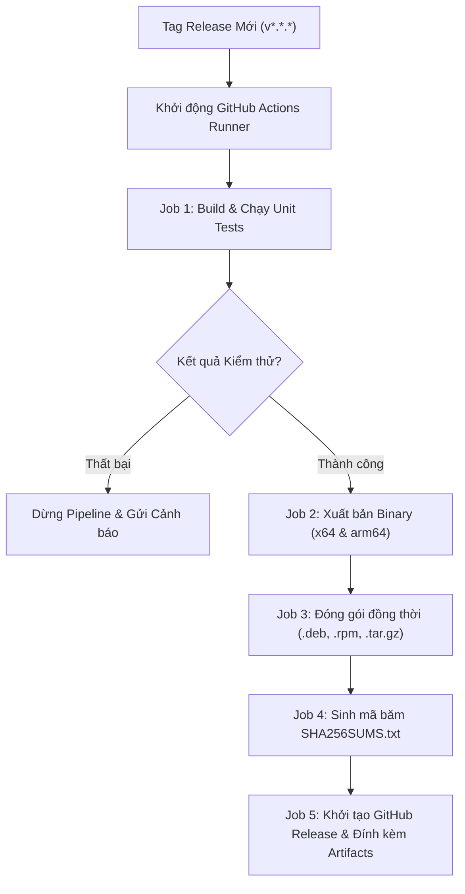

# BẢN THIẾT KẾ CHI TIẾT (DETAIL DESIGN): MILESTONE 6
## ĐÓNG GÓI PHÂN PHỐI NATIVE LINUX & QUY TRÌNH CI/CD TỰ ĐỘNG

- **Mã tài liệu:** DD-M6-PACKAGING-DISTRIBUTION
- **Vị trí lưu trữ:** `docs/2.Design/Design_M6_Packaging_and_Distribution.md`
- **Phiên bản:** 2.0.0 (Nâng cấp toàn diện từ Basic Design lên Detail Design)
- **Ngày phê duyệt:** 2026-10-05
- **Tài liệu căn cứ:** 
  - [`SRS_podman-FUI.md`](../1.Investigation/SRS_podman-FUI.md)
  - [`05_Packaging_and_Cross_Distro_Investigation.md`](../1.Investigation/05_Packaging_and_Cross_Distro_Investigation.md)
- **Tài liệu tiến độ gắn kèm:** [`Milestone_6_Packaging_and_CICD.md`](../3.Progress/Milestone_6_Packaging_and_CICD.md)

---

## 1. TỔNG QUAN & PHẠM VI THIẾT KẾ CHI TIẾT

Tài liệu này đặc tả chi tiết kiến trúc tầng đóng gói và tự động hóa phát hành cho Milestone 6:
- Cơ chế biên dịch xuất bản tệp nhị phân độc lập dạng Single-File Self-Contained cho 2 kiến trúc vi xử lý `linux-x64` và `linux-arm64`.
- Đặc tả cấu trúc tệp dữ liệu đóng gói chuẩn cho Debian/Ubuntu (`.deb`) và Fedora/RHEL (`.rpm`), cùng phiên bản nén di động (`.tar.gz`).
- Quy trình tự động hóa kiểm thử, biên dịch đa nền tảng, tạo mã kiểm tra toàn vẹn SHA256, và xuất bản GitHub Releases thông qua GitHub Actions.
- **Tuân thủ tuyệt đối:** Trình bày hoàn toàn bằng lời văn, bảng biểu, quy trình thuật toán tuần tự, không sử dụng code sample (Zero Code Sample).

---

## 2. PHÂN RÃ DANH MỤC TỆP ĐÓNG GÓI & CẤU HÌNH (PACKAGING INVENTORY)

Milestone 6 bổ sung các tệp tài nguyên đóng gói vào thư mục gốc của repository:

### 2.1. Thư mục Đóng gói Debian (`packaging/debian/`)
- **Tệp: `control` (Siêu dữ liệu gói Debian):**
  - Khai báo tên gói `podman-fui`, phiên bản, kiến trúc mục tiêu, phụ thuộc hệ thống (`libc6`, `podman`).
- **Tệp: `postinst` (Kịch bản sau khi cài đặt):**
  - Thiết lập quyền thực thi `0755` cho file nhị phân tại `/usr/bin/podman-fui`, kích hoạt cập nhật lại cơ sở dữ liệu manpage (`mandb -q`).
- **Tệp: `prerm` (Kịch bản dọn dẹp trước khi gỡ cài đặt):**
  - Dọn dẹp an toàn các liên kết biểu tượng hoặc tệp cấu hình tạm.

### 2.2. Thư mục Đóng gói RPM (`packaging/rpm/`)
- **Tệp: `podman-fui.spec` (Tệp đặc tả đóng gói RPM Spec):**
  - Khai báo các khối: `Name`, `Version`, `Release`, `Summary`, `License`, `URL`, `Requires`, `%prep`, `%build`, `%install`, `%files`.

### 2.3. Thư mục Tài liệu Hệ thống & Di động (`packaging/`)
- **Tệp: `packaging/man/podman-fui.1`:**
  - Trang hướng dẫn chuẩn UNIX (UNIX Man Page) mô tả cú pháp dòng lệnh, các biến môi trường hỗ trợ (`CONTAINER_HOST`, `PODMAN_SOCKET`), và bảng phím tắt.
- **Tệp: `packaging/tarball/install.sh`:**
  - Kịch bản shell tự động cài đặt binary vào thư mục cá nhân `~/.local/bin/` mà không đòi hỏi quyền quản trị viên `sudo`.

### 2.4. Thư mục Quy trình CI/CD (`.github/workflows/`)
- **Tệp: `ci.yml` (Quy trình tích hợp liên tục khi mở Pull Request):**
  - Thực thi kiểm tra định dạng mã nguồn, biên dịch kiểm thử toàn bộ Solution và chạy Unit Tests.
- **Tệp: `release.yml` (Quy trình xuất bản khi gắn Tag phiên bản):**
  - Tự động biên dịch `linux-x64` và `linux-arm64`, đóng gói đồng thời `.deb`, `.rpm`, `.tar.gz`, sinh file mã băm `SHA256SUMS.txt`, và phát hành GitHub Release.

---

## 3. ĐẶC TẢ CHI TIẾT CẤU TRÚC GÓI CÀI ĐẶT (PACKAGING CONTRACTS)

### 3.1. Đặc tả Trường Siêu Dữ Liệu Gói `.deb` (`DEBIAN/control`)

| Tên trường | Giá trị đặc tả | Bắt buộc | Mô tả chức năng |
| :--- | :--- | :---: | :--- |
| `Package` | `podman-fui` | Có | Định danh gói trên các hệ quản lý gói APT. |
| `Version` | Đồng bộ theo thẻ Git (Ví dụ: `1.0.0`) | Có | Phiên bản phát hành chính thức của phần mềm. |
| `Section` | `utils` | Có | Phân loại ứng dụng vào nhóm công cụ tiện ích hệ thống. |
| `Priority` | `optional` | Có | Mức độ ưu tiên của gói cài đặt trên hệ điều hành. |
| `Architecture` | `amd64` hoặc `arm64` | Có | Kiến trúc tập lệnh vi xử lý tương ứng. |
| `Depends` | `libc6 (>= 2.31), podman (>= 4.0.0)` | Có | Danh sách gói thư viện và dịch vụ bắt buộc phải có trên máy host. |
| `Maintainer` | `Podman-FUI Developers <https://github.com/thatislg/podman-fui>` | Có | Thông tin tác giả và địa chỉ liên hệ bảo trì gói. |
| `Description` | "Modern terminal user interface for Podman container engine written in F#" | Có | Tóm tắt tính năng ứng dụng hiển thị khi tra cứu `apt info`. |

### 3.2. Sơ đồ Vị trí Tệp Cài đặt trên Hệ Thống Linux (FHS Standard)

| Đường dẫn đích trên Máy Host | Quyền truy cập (Permissions) | Người sở hữu | Mô tả tệp |
| :--- | :---: | :---: | :--- |
| `/usr/bin/podman-fui` | `0755` (`rwxr-xr-x`) | `root:root` | Tệp nhị phân thực thi độc lập (Single-file self-contained binary). |
| `/usr/share/man/man1/podman-fui.1.gz` | `0644` (`rw-r--r--`) | `root:root` | Tệp tài liệu tra cứu manpage đã qua nén gzip. |
| `/usr/share/doc/podman-fui/copyright` | `0644` (`rw-r--r--`) | `root:root` | Tệp tuyên bố giấy phép bản quyền nguồn mở (Apache 2.0). |

---

## 4. ĐẶC TẢ CHI TIẾT THUẬT TOÁN BIÊN DỊCH & ĐÓNG GÓI

### 4.1. Thuật toán Xuất bản .NET Single-File Tự chứa (Publish Engine)
- **Đầu vào:** Kiến trúc mục tiêu `runtimeIdentifier` (`linux-x64` hoặc `linux-arm64`), Cấu hình `Release`.
- **Đầu ra:** Tệp nhị phân duy nhất tại `bin/Release/net10.0/<rid>/publish/podman-fui`.
- **Quy trình thiết lập tham số biên dịch tuần tự:**
  1. Chỉ định Runtime: Thiết lập tham số Runtime Identifier `--runtime <runtimeIdentifier>`.
  2. Bật chế độ Tự chứa: `SelfContained = true` (Đóng gói kèm toàn bộ runtime .NET, loại bỏ hoàn toàn yêu cầu cài đặt máy ảo trên máy khách).
  3. Bật chế độ Tệp Đơn nhất: `PublishSingleFile = true` (Gộp toàn bộ IL, thư viện quản lý, và thư viện native thành 1 file).
  4. Bật chế độ Nén Tích hợp: `EnableCompressionInSingleFile = true` (Giảm dung lượng tệp nhị phân xuống khoảng 35MB).
  5. Cắt tỉa thành phần thừa: `PublishTrimmed = false` (Giữ nguyên độ tương thích hoàn hảo cho thư viện Terminal.Gui và phân tích phản xạ Reflection).
  6. Thực thi lệnh biên dịch xuất bản `dotnet publish src/PodmanFUI.App/PodmanFUI.App.fsproj`.
  7. Kiểm tra tệp sinh ra và phân quyền thực thi `chmod +x` cho tệp nhị phân.

---

### 4.2. Thuật toán Lắp ráp Gói Debian (`.deb` Staging Engine)
- **Đầu vào:** File nhị phân đã biên dịch, Thư mục khuôn mẫu `packaging/debian/`.
- **Đầu ra:** Gói cài đặt `podman-fui_<version>_<arch>.deb`.
- **Quy trình tuần tự từng bước:**
  1. Tạo thư mục dàn dựng tạm thời: `staging/podman-fui_<version>_<arch>/`.
  2. Tạo các thư mục con theo chuẩn FHS:
     - `DEBIAN/`
     - `usr/bin/`
     - `usr/share/man/man1/`
     - `usr/share/doc/podman-fui/`
  3. Sao chép file `packaging/debian/control` vào `DEBIAN/`, thay thế biến phiên bản và kiến trúc tương ứng.
  4. Sao chép file nhị phân `podman-fui` vào `usr/bin/` và gán quyền `0755`.
  5. Nén file manpage bằng lệnh `gzip -9` và sao chép vào `usr/share/man/man1/podman-fui.1.gz` với quyền `0644`.
  6. Sao chép file LICENSE vào thư mục `usr/share/doc/podman-fui/copyright`.
  7. Gọi công cụ hệ thống `dpkg-deb --build --root-owner-group` trên thư mục dàn dựng.
  8. Kiểm tra tính hợp lệ của gói bằng công cụ phân tích tĩnh `lintian`.

---

### 4.3. Thuật toán Lắp ráp Gói RPM (`.rpm` Build Engine)
- **Đầu vào:** File nhị phân, Tệp đặc tả `packaging/rpm/podman-fui.spec`.
- **Đầu ra:** Gói cài đặt `podman-fui-<version>-1.<arch>.rpm`.
- **Quy trình tuần tự từng bước:**
  1. Khởi tạo cấu trúc cây thư mục RPM: `rpmbuild/{BUILD,RPMS,SOURCES,SPECS,SRPMS}`.
  2. Đặt file nhị phân vào thư mục SOURCES dưới dạng file nén tarball gốc.
  3. Sao chép file `.spec` vào thư mục SPECS.
  4. Chạy lệnh đóng gói `rpmbuild -bb SPECS/podman-fui.spec`.
  5. Thu thập gói nhị phân `.rpm` đã được ký và đóng gói hoàn chỉnh từ thư mục RPMS.

---

### 4.4. Quy trình Tự động hóa CI/CD trên GitHub Actions
Quy trình phát hành tự động được kích hoạt khi có sự kiện đẩy thẻ phiên bản mới (`git push origin v*.*.*`):

- **Quy trình chi tiết từng bước:**
  1. Khởi chạy môi trường Ubuntu runner sạch.
  2. Thiết lập .NET SDK phiên bản 10.x.
  3. Chạy lệnh kiểm tra định dạng và thực thi toàn bộ kiểm thử đơn vị.
  4. Biên dịch song song hai luồng xuất bản cho kiến trúc `linux-x64` và `linux-arm64`.
  5. Đóng gói thành các định dạng: `.deb`, `.rpm`, `.tar.gz`.
  6. Sử dụng lệnh `sha256sum * > SHA256SUMS.txt` để ghi nhận mã kiểm tra tính toàn vẹn cho toàn bộ các file artifact.
  7. Gọi API GitHub Releases để tạo bản phát hành mới, tự động trích xuất nội dung Changelog và đính kèm đầy đủ các gói cài đặt.

---

## 5. MA TRẬN MÃ LỖI & KỊCH BẢN XỬ LÝ NGOẠI LỆ (ERROR MATRIX)

| Mã Lỗi | Tên Lỗi Kỹ Thuật | Nguyên Nhân Gốc | Phản Ứng Hệ Thống | Thông Báo Hiển Thị |
| :---: | :--- | :--- | :--- | :--- |
| **`ERR_PKG_GLIBC_OLD`** | `GlibcVersionMismatch` | Máy người dùng sử dụng bản phân phối Linux quá cũ (glibc < 2.31) | Trình cài đặt APT/RPM từ chối cài đặt gói | "Yêu cầu phiên bản glibc tối thiểu 2.31. Vui lòng nâng cấp hệ điều hành hoặc sử dụng bản di động container." |
| **`ERR_PKG_NO_PODMAN`** | `PodmanDependencyMissing`| Máy khách chưa cài đặt gói phần mềm `podman` | Trình quản lý gói tự động kéo dependency hoặc cảnh báo | "Ứng dụng yêu cầu gói 'podman' hoạt động trên hệ thống. Đang tự động cài đặt dependency..." |
| **`ERR_PKG_PERM_DENIED`**| `InstallationPermissionDenied` | Người dùng chạy lệnh cài đặt không có quyền `sudo` hoặc `root` | Gợi ý sử dụng bản di động tarball cài vào thư mục `$HOME` | "Cần quyền quản trị viên để cài đặt vào /usr/bin. Hoặc bạn có thể dùng bản di động .tar.gz không cần sudo." |
| **`ERR_CHECKSUM_FAIL`** | `ChecksumVerificationFailed`| Quá trình tải file bị lỗi truyền dẫn làm sai lệch mã băm SHA256 | Script cài đặt từ chối thực thi và xóa file hỏng | "Mã băm SHA256 không khớp! File tải về có thể đã bị lỗi hoặc can thiệp." |

---

## 6. MA TRẬN KỊCH BẢN KIỂM THỬ NGHIỆM THU (TEST CASES MATRIX)

| Mã Ca Kiểm Thử | Tên Kịch Bản Kiểm Thử | Điều Kiện Tiền Đề | Các Bước Thực Hiện | Tiêu Chí Đạt Nghiệm Thu (Pass Criteria) |
| :---: | :--- | :--- | :--- | :--- |
| **TC-M6-01** | Cài đặt và thực thi gói `.deb` trên Debian/Ubuntu/Mint | Máy tính không cài sẵn bất kỳ phiên bản .NET SDK nào | Chạy `sudo dpkg -i podman-fui_*.deb`, sau đó gõ lệnh `podman-fui` | Cài đặt thành công không báo lỗi thiếu file; ứng dụng TUI khởi động trực tiếp trong vòng dưới 1 giây. |
| **TC-M6-02** | Cài đặt và thực thi gói `.rpm` trên Fedora/RHEL | Máy Fedora 39/40 chạy rootless podman | Chạy `sudo dnf install podman-fui-*.rpm`, sau đó gõ `podman-fui` | Cài đặt thành công, gói được ghi nhận trong cơ sở dữ liệu `rpm -qa`, ứng dụng kết nối chuẩn xác tới rootless socket. |
| **TC-M6-03** | Chạy bản di động Tarball không cần quyền root | Người dùng thông thường không có quyền sudo | Giải nén file `.tar.gz` và chạy `./install.sh` | File nhị phân được đặt vào `~/.local/bin/podman-fui`, gõ lệnh chạy bình thường không phát sinh lỗi phân quyền. |
| **TC-M6-04** | Kiểm tra tài liệu hướng dẫn UNIX Manpage | Đã cài đặt ứng dụng qua deb hoặc rpm | Gõ lệnh `man podman-fui` | Hệ thống hiển thị đầy đủ trang manpage chuẩn: Tên, cú pháp, danh sách phím tắt, thông tin tác giả. |
| **TC-M6-05** | Xác thực tính toàn vẹn mã băm SHA256 | Tải toàn bộ các file artifact từ GitHub Release | Chạy lệnh `sha256sum -c SHA256SUMS.txt` | Toàn bộ các file đều đạt trạng thái `OK`, khẳng định dữ liệu phân phối nguyên vẹn 100%. |

---

## 7. KẾT LUẬN & ĐIỀU KIỆN CHUYỂN BƯỚC THỰC THI

Bản Thiết kế Chi tiết này hoàn thiện toàn bộ đặc tả cho khâu đóng gói native Linux, các trường metadata chuẩn FHS, quy trình CI/CD tự động hóa trên GitHub Actions, và ma trận kiểm thử nghiệm thu cho Milestone 6.

Toàn bộ tài liệu đảm bảo không chứa mã nguồn lập trình cụ thể, đáp ứng trọn vẹn tiêu chuẩn khắt khe của dự án.
